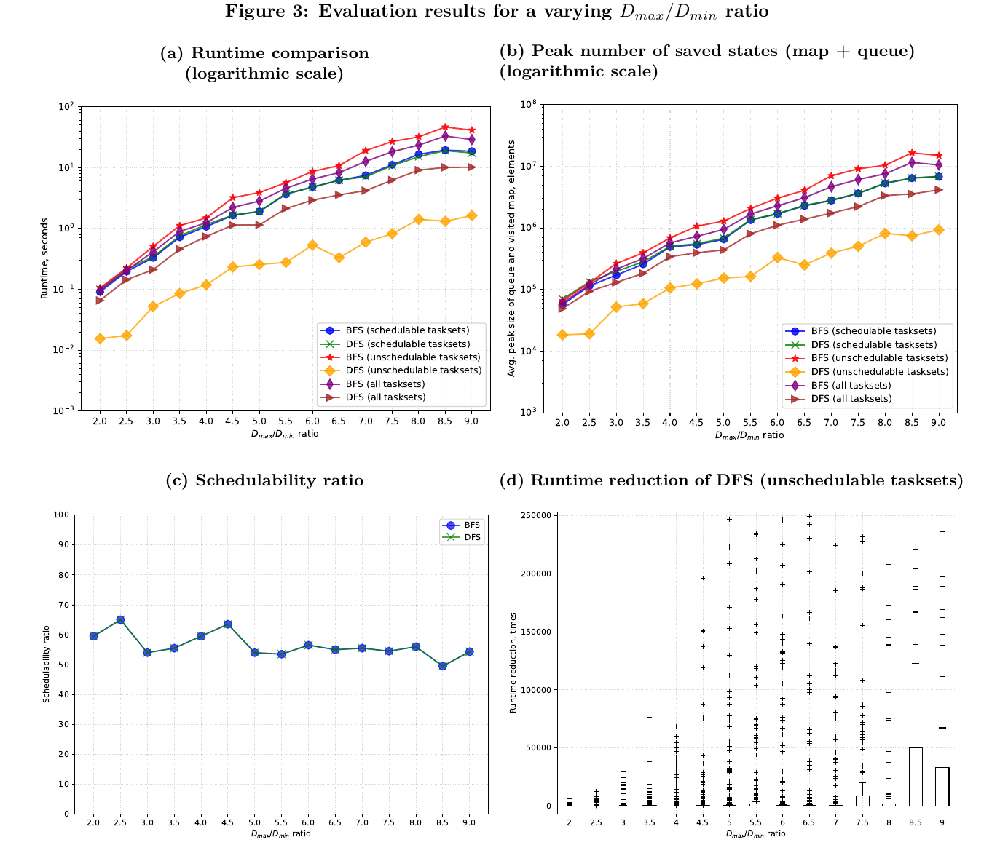

# schedtest_benchmark_tool
A benchmarking and plotting tool for exact schedulability test allowing to immediately run CPLEX-generated tasksets on GFP schedulability tests


The scripts are intended to measure performance for exact schedulability test by Bonifaci et al. 2012 and its modifications.

`evaluate.py` performs benchmarking given a taskset file with input data and list of executables to be benchmarked.
It captures the stdout of the benchmarked binary.

```usage: evaluate.py [-h] taskset_file executables_list output_dir```

Output directory will contain two .txt files with results: `evaluation_plotter_q.txt` can be fed to plotter and `evaluation_xls.txt` is meant to be used in Excel.


The only difference is the order of columns. Lines starting with `#` are comments and are ignored.

`plotter.py` performs plotting by different parameters. Varying parameter (the one to be placed on x-axis) is determined automatically.

```usage: plotter.py [-h] [-o OUTPUT_DIR] [-n] input_file executables_labels```

Plots are saved in .pdf format. If the output dir is not specified, plots will be saved in the working directory.

